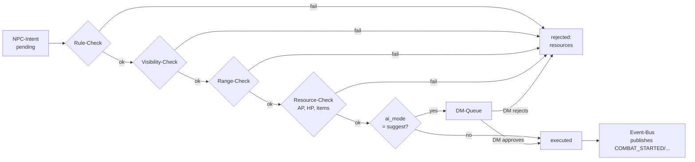

# AI-Agent

> Bot-Architektur, Event-Protokoll, NPC-Kontext-Aufbau, Prompt-Pattern. Siehe [`ADR/002`](ADR/002-ki-service-python.md) und [`ADR/005`](ADR/005-ki-validation-layer.md) für Begründungen.

---

## 1. Übersicht

Der AI-Bot ist ein **separater Prozess**, der:
1. Welt-Events vom Backend pollt
2. Für jede betroffene NPC einen **Kontext** aufbaut
3. Einen Prompt an ein LLM schickt
4. Die Antwort als `NpcIntent` ans Backend sendet
5. **Nie direkt ausführt** — Execution passiert im Backend nach Validierung

```
   Backend (Spring)            AI-Bot (FastAPI)
  ┌─────────────────┐         ┌───────────────────────┐
  │  world_events   │  poll   │  poller.py (asyncio)  │
  │  npc_intents    │ ◄──────►│  context_loader.py    │
  │  entities       │         │  prompts/jinja2       │
  │  (read-only     │ POST    │  llm_client.py        │
  │  für Bot)       │ ──────►│                       │
  │  validator      │         └───────────────────────┘
  │  executor       │                    │
  └────────┬────────┘                    │ HTTP
           │                             ▼
           │                       ┌─────────┐
           │ WS broadcast          │ Ollama  │
           ▼                       │ (LLM)   │
        Spieler                    └─────────┘
```

---

## 2. Bot-Service-Aufbau

### 2.1 Ordnerstruktur
```
ai-bot/
├── pyproject.toml         # uv + pytest, ruff
├── Containerfile          # OCI-Build (von Podman gelesen; "Dockerfile" als Alias ebenfalls möglich)
├── src/ai_bot/
│   ├── main.py            # FastAPI app + lifespan (start poller)
│   ├── config.py           # Pydantic-Settings (env based)
│   ├── poller.py           # Event-Polling Loop
│   ├── context_loader.py   # NPC-Kontext aufbauen
│   ├── llm_client.py       # Ollama/OpenAI Client
│   ├── models.py           # Pydantic-Modelle
│   ├── api_client.py       # HTTP-Client für Backend
│   └── prompts/
│       ├── __init__.py
│       ├── aggressiv.j2    # Jinja2 Templates
│       ├── neutral.j2
│       └── vorsichtig.j2
└── tests/
```

### 2.2 Lifespan
```python
@asynccontextmanager
async def lifespan(app: FastAPI):
    poller = EventPoller(config=...)
    task = asyncio.create_task(poller.run())
    yield
    task.cancel()
```

### 2.3 Konfiguration (`config.py`)
```python
class Settings(BaseSettings):
    backend_url: str = "http://localhost:8080/api"
    service_token: str | None = None
    ollama_url: str = "http://localhost:11434"
    ollama_model: str = "llama3"
    poll_interval_ms: int = 2000
    context_max_tokens: int = 4096
    llm_timeout_s: int = 30
    worlds_filter: list[str] = []        # Leere Liste → alle Welten mit `ai_mode != "off"`
```

---

## 3. Event-Polling

### 3.1 Polling-Loop (Vereinfachung)
```python
class EventPoller:
    async def run(self):
        last_event_ids = {}  # world_id -> last_event_id
        while True:
            for world_id in self.active_worlds():
                events = await self.api.fetch_events(
                    world_id,
                    since=last_event_ids.get(world_id, 0)
                )
                for event in events:
                    await self.handle_event(world_id, event)
                last_event_ids[world_id] = events[-1].id if events else last_event_ids.get(world_id, 0)
            await asyncio.sleep(self.settings.poll_interval_ms / 1000)
```

### 3.2 Why polling statt Webhook?
- Polling ist resilienter gegen Backend-Neustarts
- Bot kann eigenes Rate-Limit halten
- Ereignisreihenfolge via `last_event_id` deterministisch
- Polling-Intervall 2 s in dev ist ausreichend (Phase 4); produktiv bei Bedarf kleiner

Phase 5 kann auf Webhooks umgestellt werden (`/api/bot/events/subscribe`), falls Performance-KPIs exigieren.

### 3.3 Idempotenz
- Backend speichert `event_hash` dedupliziert
- Bot speichert `last_event_id` persistiert (sqlite oder in DB)
- Bot ist crash-safe — replay von events verhindert Because validated_by_event_hash in npc_intents UNIQUE

---

## 4. NPC-Kontext-Aufbau

### 4.1 Was fließt in den Prompt?

| Datenquelle | Inhalt |
|---|---|
| `entities` (NPC selbst) | Name, Attribute, `metadata_json.personality`, `metadata_json.knowledge`, `metadata_json.goals` |
| `entities` (umgebende NPC/PC) | Name, Fraktion, Position, HP-State (wenn relevant) |
| `world_events` (zuletzt) | Letzte 5 Events in der Welt, gekürzt |
| Aktuelles Event | Was gerade passiert ist (Trigger für Intent) |
| Welt-Status | `worlds.settings_json.ai_mode`, current combat status, `worlds.settings_json.language` (BCP 47) |
| NPC-Sprache | `worlds.settings_json.language` — LLM-Antwortsprache für `SPEAK`-Aktion |
| Tageszeit / Tag-Phase | `worlds.current_game_time` + abgeleitetes `day_phase` (`dawn`/`day`/`dusk`/`night`). Siehe [`ADR/009`](ADR/009-world-time-calendar-system.md) |
| NPC-Schedule | `entities.metadata_json.schedule.active_during[]`, optional `sleeps_at_dusk`-Flag (z. B. `["day","dawn"]`) |

### 4.2 Token-Limit
- Kontext-Target: ~3,5k Token
- Output-Budget: ~500 Token
- Reserve: ~500 Token für Systemprompt
- → 4k-Context-Modelle reichen aus (Llama 3 8B Instruct)

### 4.3 Kontext-Loader (Python)
```python
class ContextLoader:
    async def build(self, npc_id: UUID, trigger_event: WorldEvent) -> NPCContext:
        npc = await self.api.get_entity(npc_id)
        nearby = await self.api.get_entities_in_radius(
            world_id=npc.world_id,
            center=npc.position,
            radius=10
        )
        recent_events = await self.api.get_events(
            world_id=npc.world_id,
            limit=5
        )
        return NPCContext(
            npc=npc,
            nearby=self._filter_relevant(nearby),
            recent_events=recent_events,
            trigger=trigger_event,
        )
```

---

## 5. Prompt-Templates (Jinja2)

### 5.1 System-Prompt (für alle Templates gleich)
```text
Du bist der Geist einer Rollenspiel-Welt. Du steuerst NPCs basierend
auf deren Persönlichkeit, Wissen und Zielen. Du antwortest **ausschließlich**
mit einem gültigen JSON-Objekt ohne weitere Erläuterung.

Sprache: Antworte in {{ language }} (BCP 47-Tag). Das `reasoning`-Feld
bleibt technisch-knappe (englisch/deutsch gemäß `language`), das
`message`-Feld bei SPEAK-Aktionen in der NPC-Sprache.

Verfügbare Aktionen:
- ATTACK  (Parameter: target_id, weapon_id)
- MOVE    (Parameter: destination: {x, y})
- SPEAK   (Parameter: target_id, message)
- USE_ITEM(Parameter: item_id, target_id?)
- IDLE    (keine Parameter)

JSON-Format:
{
  "action": "ATTACK",
  "target_id": "uuid",
  "reasoning": "knappe Begründung"
}
```

`{{ language }}` wird aus `worlds.settings_json.language` injiziert — siehe [`ADR/007`](ADR/007-internationalization-strategy.md).

### 5.2 User-Prompt (Aggressiv)
```text
NPC: {{ npc.name }} ({{ npc.entity_type }})
Persönlichkeit: {{ npc.metadata.personality }}
Wissen: {{ npc.metadata.knowledge | join(", ") }}
Ziele: {{ npc.metadata.goals | join(", ") }}
Position: ({{ npc.position.x }}, {{ npc.position.y }})

Letzte Ereignisse:

- {{ e.event_type }}: {{ e.payload | tojson }}


Aktuelles Ereignis: {{ trigger.event_type }}
{{ trigger.payload | tojson }}

Umgebung:

- {{ other.name }} ({{ other.entity_type }}, {{ other.faction_name or "keine Fraktion" }})


Tageszeit: {{ time.day_phase }} ({{ time.current_game_time }})
Aktiv während: {{ npc.metadata.schedule.active_during | join(", ") }}


Du hasst Konflikte nicht, aber du beschützt dein Territorium entschlossen.
Was tust du? Antworte mit JSON.
```

Die `Tageszeit`-Zeile ist in allen drei Templates enthalten (die übrigen Templates referenzieren „gleicher Kontext" inkl. Tageszeit). Siehe [`ADR/009`](ADR/009-world-time-calendar-system.md) für die Berechnung von `day_phase` und `current_game_time`.

### 5.3 User-Prompt (Vorsichtig)
```text
[gleicher Kontext]

Du bist kühl und abwartend. Du vermeidest Kampf, außer direkt angegriffen.
Bevorzugst Aktion SPEAK oder IDLE außer in klarer Gefahr.
Was tust du? Antworte mit JSON.
```

### 5.4 User-Prompt (Neutral)
```text
[gleicher Kontext]

Du verhältst dich neutral und proaktiv. Du handelst rational basierend
auf deinen Zielen. Bevorzugt SPEAK oder USE_ITEM.
Was tust du? Antworte mit JSON.
```

---

## 6. LLM-Integration

### 6.1 Ollama-Client
```python
class OllamaClient:
    async def generate(self, system_prompt: str, user_prompt: str) -> dict:
        async with httpx.AsyncClient(timeout=self.settings.llm_timeout_s) as client:
            response = await client.post(
                f"{self.settings.ollama_url}/api/generate",
                json={
                    "model": self.settings.ollama_model,
                    "system": system_prompt,
                    "prompt": user_prompt,
                    "stream": False,
                    "format": "json",
                }
            )
            data = response.json()
            return json.loads(data["response"])  # Pydantic-validierung vorher
```

### 6.2 Output-Validierung (Pydantic)
```python
class NpcIntentProposal(BaseModel):
    action: Literal["ATTACK", "MOVE", "SPEAK", "USE_ITEM", "IDLE"]
    target_id: UUID | None = None
    destination: dict | None = None
    item_id: UUID | None = None
    message: str | None = None
    reasoning: str
```

Bei invalidem JSON:
1. Einmaliger Retry mit Hinweis an LLM: „Du musst mit gültigem JSON antworten"
2. Bei erneutem Fehlschlag: Intent `IDLE` mit `reasoning: "LLM-Output invalid"`loggen

### 6.3 Fallback bei Ollama down
- HTTP-Fehler → `OllamaUnavailable` Exception
- Bot pausiert NPCs für diese Welt
- Lobby: DM wird via Event `NPC_INTENT_FAILED` mit `reasoning: "LLM unavailable"` notified
- Retry in 60 s

---

## 7. Validator-Schicht im Backend

### 7.1 Validation-Pipeline


### 7.2 Regel-Checks
| Intent | Validiert gegen |
|---|---|
| `ATTACK` | Range (Waffenreichweite), AP, Sichtlinie (Grid), HP des Angreifers > 0 |
| `MOVE` | Ziel-Tile begehbar, nicht blocked, AP > 0 |
| `SPEAK` | `target_id` existiert und ist in Hörreichweite (z. B. 8 Tiles) |
| `USE_ITEM` | Item in Inventar, targetType korrekt |
| `IDLE` | Immer erlaubt |

### 7.3后果
- `rejected` → `rejection_reason` gesetzt, Event `NPC_INTENT_REJECTED` gepublished
- `executed` → Aktion in Welt-Logik angewendet, ein oder mehrere neue `world_events` erzeugt, die nächste Polling-Runde triggern können (—> Emergenz)

---

## 8. Human-Fallback (DM-Interface)

### 8.1 Modi pro Welt
| `ai_mode` | Verhalten |
|---|---|
| `autonom` | Validierter Intent wird sofort ausgeführt. DM sieht es im Log. |
| `suggest` | Validierter Intent wartet auf DM-Approval (DM-Queue Panel). |
| `off` | Bot pausiert keine Intents vorschlagen. NPC bleibt passiv. Only DM steuert. |

### 8.2 DM-Queue (Frontend)
- Panel nur für DM sichtbar (`world_members.role == 'DM'`)
- Subscription `/topic/dm/intents/{worldId}`
- Aktionen: Approve, Reject, Edit (parameter ändern), Self-Steer (DM übernimmt NPC)

---

## 9. NPC-Typ-Erkennung

| `metadata_json.personality` | Template | Beschreibung |
|---|---|---|
| `aggressiv` | aggressiv.j2 | Schnell am Angriff, beschützt Territorium |
| `neutral` | neutral.j2 | Rational, proaktiv |
| `vorsichtig` | vorsichtig.j2 | Vermeidet Kampf, redet lieber |
| `magier` | aggressiv.j2 | Special Template for KI-Modell, Prefix mit `{{ npc.metadata.school }}`-Systemprompt |
| `händler` | neutral.j2 | Verkauft, verhandelt statt zu kämpfen |

Neue Templates via Code-Erweiterung; Substitution pro NPC erfolgt bei Prompt-Runtime.

---

## 10. Prompt-Testbarkeit

- Jeder Prompt als Jinja2-Template testebar mit Mock-Kontext
- Fixtures: `tests/fixtures/npc_contexts/*.json`
- `pytest tests/prompts/test_aggressiv.py` vergleicht gerenderten Prompt mit golden file
- Verhindert Prompt-Drift durch Refactoring

---

## 11. Skalierbarkeit (Phase 5)

- Bot-Instanzen horizontal skalierbar (via Podman/K8s)
- Message-Broker (RabbitMQ / Kafka) als Zwischenschicht möglich
- Pro Welt maximal eine aktive Bot-Instanz (Vermeidung duplizierter Intents)
- Optional shard by world_id via Service-Discovery

Phase 5 — falls Bot CPU/Rate-limitiert → HTTP-Queue-System für Prompts in Bot-Service (AI Tasks einreihend).