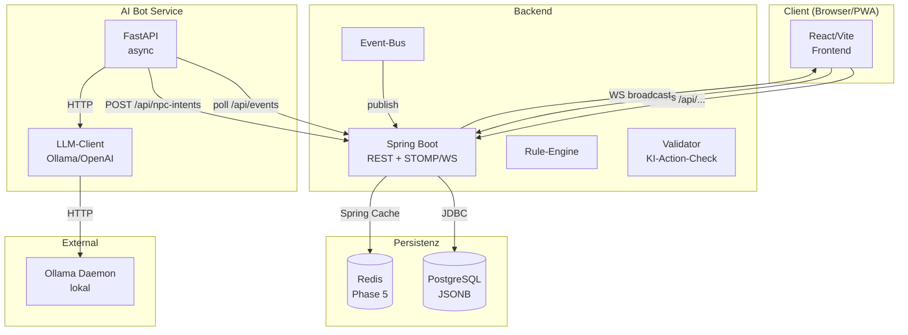
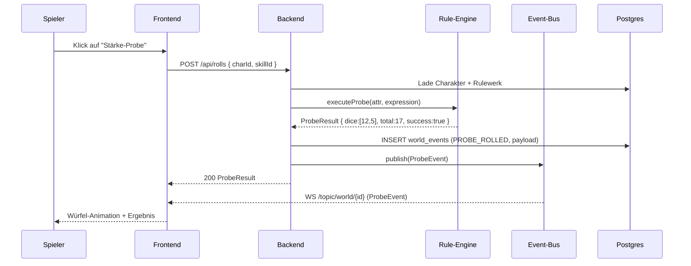
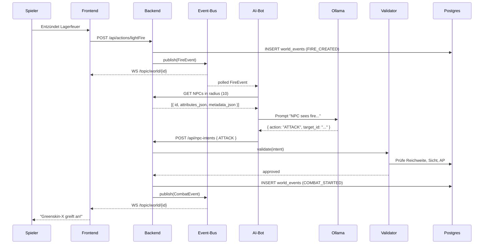

# Architektur

> Zur Übersicht der Komponenten, ihrer Zusammenspiele und der Sicherheits/Deployment-Topologien.

---

## 1. Systemkontext



---

## 2. Komponentenbeschreibung

### 2.1 Frontend — React + Vite + PixiJS
- **Stack:** TypeScript, Vite, React 18+, Zustand, @pixi/react, @stomp/stompjs, axios
- **Zuständigkeiten:**
  - UI-Rendering (Charakterbogen, Chat, Dashboard)
  - Karteninteraktion via PixiJS (Grid, Token, Fog of War)
  - WebSocket-Client für Live-Updates
  - Auth-Flow + JWT-Verwaltung
- **Nicht enthalten:** Spiellogik. Würfel werden vom Backend berechnet, Frontend zeigt nur Ergebnisse.

### 2.2 Backend — Spring Boot
- **Stack:** Java 21, Spring Boot 3.3.x, Spring Security, Spring Data JPA, Flyway, Spring WebSocket (STOMP)
- **Module:**
  - `com.lwe.core` — Domain-Modelle, Services
  - `com.lwe.api` — REST-Controller
  - `com.lwe.config` — Spring-Konfiguration
  - `com.lwe.security` — JWT, AuthFilter, SecurityConfig
  - `com.lwe.rules` — Rule-Engine
  - `com.lwe.events` — Event-Bus, WorldEventService
  - `com.lwe.ai` — NPC-Intent Endpunkte + Validator
  - `com.lwe.combat` — Kampf-System
  - `com.lwe.time` — Time Engine (`WorldTimeService`, `DayPhaseCalculator`, Scheduled Ticks)
  - `com.lwe.i18n` — Locale-Resolver, MessageSource-Konfiguration
- **Kommunikation nach außen:** REST (`/api/...`) + STOMP-over-Websocket (`/ws`)
- **Externe Abhängigkeiten:** PostgreSQL, optional Redis (Phase 5)

### 2.3 AI-Bot — Python/FastAPI
- **Stack:** Python 3.12+, FastAPI, Pydantic, httpx, jinja2
- **Zuständigkeiten:**
  - Pollen von Welt-Events
  - Aufbauen von NPC-Kontext
  - LLM-Prompt generieren
  - Intent an Backend schicken
- **Nicht enthalten:** Validierung oder Ausführung. Der Bot darf ausschließlich **vorschlagen**. Execution passiert im Backend.

### 2.4 Persistenz — PostgreSQL
- Relationale Integrität + JSONB für flexible/für Konfigurationen.
- Haupttabellen: `users`, `game_systems`, `worlds`, `world_members`, `entities`, `world_events`, `npc_intents`.
- Siehe [`DATA-MODEL.md`](DATA-MODEL.md) für das vollständige Schema.

### 2.5 Cache — Redis (Phase 5)
- Spring Cache-Backend
- Cache für `game_systems.rules_json` Invalidate bei Update
- Optional: Session-Storage für WS-Scaling

---

## 3. Datenfluss-Szenarien

### 3.1 Spieler würfelt eine Probe



### 3.2 NPC handelt autonom



### 3.3 DM startet eine Session
1. DM wählt Welt und aktive Karte
2. DM lädt Spieler via Link
3. Spieler treten in die Welt ein (WS-Verbindung)
4. DM shared visiblen Kartenbereich (Fog of War updates via WS)
5. Spieler-aktionen erzeugen Events → speisen Hintergrundsimulation

---

## 4. Sicherheitsarchitektur

### 4.1 Authentifizierung
- JWT (Access-Token 24 h, Refresh 7 d)
- BCrypt-Hash 12 Rounds
- Token im Frontend in memory (nicht localStorage, siehe [`ADR/001`](ADR/001-frontend-react-vite.md))
- WS-STOMP-Header `Authorization: Bearer {jwt}` für WS-Auth

### 4.2 Autorisierung
- Rolle `USER` (Standard): Volle Rechte für eigene Welten
- Rolle `ADMIN`: User-Verwaltung, Bot-Status, Systemweite Stats
- Owner-Check in `WorldController`, `EntityController` etc. (Spring Security `@PreAuthorize`)

### 4.3 Tenant-Isolation (Phase 5)
- Postgres RLS: `SET LOCAL app.tenant_id = {owner_id}` pro Request
- Repository-Layer prüft implizit via Policy
- Siehe [`ADR/004`](ADR/004-multitenancy-shared-schema.md)

### 4.4 KI-Action-Validator
- Der AI-Bot **darf nicht direkt in die Welt schreiben**, nur Vorschläge machen (`npc_intents` der Status `pending`)
- Backend validiert jeden Intent gegen:
  1. Regelwerk-Reglelement (APs, Range)
  2. Sichtbarkeit (Fog of War)
  3. Ressourcen (Inventar / HP)
- Siehe [`ADR/005`](ADR/005-ki-validation-layer.md)

### 4.5 Input-Validierung
- Spring Validation (`@Valid`, `@NotNull`) für Request-Bodies
- JSON-Schema-Validator für hochgeladene Regelwerke
- Pydantic-Validation im Bot für interne RPCs

---

## 5. Deployment-Topologien

> Container-Runtime: **Podman** (daemon-los, rootless). Siehe [`ADR/006`](ADR/006-container-runtime-podman.md). Compose-Files sind kompatibel mit `docker compose`, aber alle Befehle in der Doku verwenden `podman`.

### 5.1 Entwicklung (`compose.yml`)
```yaml
services:
  pgadmin:    # Frontend für externen Postgres
  backend:    # Spring Boot (lokal via mvn)
  ai-bot:     # FastAPI
  frontend:   # Vite dev server
```

Postgres selbst läuft extern auf `192.168.31.151:5432` (Portainer-Host). Siehe `.env`.

Start: `podman compose up -d`

### 5.2 Produktion (`compose.prod.yml`)
```yaml
services:
  nginx:
    - reverse-proxy
    - static frontend (CDN alternative)
  backend:
    - Spring Boot
  ai-bot:
    - FastAPI
  postgres:
    - optional, wenn dedicated DB-Host nicht verfügbar
  redis:
    - Spring Cache
  ollama:
    - AI-Service (GPU-Host optional)
```

Build: `podman compose -f compose.prod.yml build` — liest `Containerfile` (Alias `Dockerfile` wird ebenfalls akzeptiert).

---

## 6. Cross-Cutting Concerns

### 6.1 Logging
- Strukturiertes JSON-Logging via Logback
- `request_id` (per Filter) für Tracing über Service-Grenzen
- Im Bot: structlog

### 6.2 Metriken
- Spring Boot Actuator + Micrometer
- `lwe_rolls_total`, `lwe_npc_intents_total{status}`, `lwe_ws_connections`, `lwe_llm_response_seconds`
- Visualisierung optional via Prometheus/Grafana (out of scope)

### 6.3 Fehlerbehandlung
- Globale `@RestControllerAdvice` → einheitliches Fehler-JSON `{ error: { code, message, details } }`
- Bot: `httpx.HTTPError`-Handling mit Backoff

### 6.4 Internationalisierung (i18n)

i18n ist ein **Cross-Cutting Concern ab Phase 1** — siehe [`ADR/007`](ADR/007-internationalization-strategy.md).

- **Backend:** `MessageSource` mit UTF-8-Resource-Bundles unter `backend/src/main/resources/i18n/` (`messages_de.properties`, `messages_en.properties`, `validation_de.properties`, `validation_en.properties`). `LocaleResolver` liest `Accept-Language`-Header (BCP 47). Fallback-Locale: `en`. Default (kein Header): `de`.
- **Frontend:** `react-i18next` + `i18next` mit Namespaces pro Feature (`common`, `auth`, `character`, `map`, `chat`, `dm`). Locale-Dateien unter `frontend/src/i18n/locales/{de,en}/`. Locale-Quellen (Priorität): User-Setting `users.locale` → `localStorage('lwe:locale')` → `navigator.language` → Fallback `de`. Sprachumschalter in TopBar.
- **LLM-Prompts:** `worlds.settings_json.language` (BCP 47) steuert NPC-Antwortsprache. Jinja2-Templates injizieren `{{ language }}` in System-Prompt.
- **Datum/Uhrzeit/Zahlen:** Frontend via `Intl.DateTimeFormat` / `Intl.NumberFormat` mit User-Locale; Backend via `java.time` + `java.text` mit `Locale`.
- **Initial ausgeliefert:** DE + EN. Architektur erlaubt neue Sprachen via JSON-Datei ohne Code-Änderung.
- **Test-Gate (Phase 3+):** CI fails, wenn i18n-Keys in `de` und `en` nicht konsistent sind.

---

## 7. Skalierungsstrategie (vorbereitet)

| Komponente | Skalierungsstrategie |
|---|---|
| Backend | Horizontal via Podman/K8s. Stateless via JWT |
| Frontend | Static CDN, unbegrenzt |
| AI-Bot | Horizontal — max. 1 Instanz pro Welt (oder Intent-Consumer) |
| Postgres | Read-Replicas für Query-Last, Partitioning für `world_events` ab bestimmter Größe |
| Redis | Cluster |

---

## 8. Verweise

- [`DATA-MODEL.md`](DATA-MODEL.md) — Schema-Details
- [`API.md`](API.md) — Endpunkt-Referenz
- [`AI-AGENT.md`](AI-AGENT.md) — Bot-Details
- [`TESTING.md`](TESTING.md) — Test-Strategie und CI-Gates
- [`ADR/`](ADR/) — Architektur-Entscheidungen, insb.:
  - [`ADR/006`](ADR/006-container-runtime-podman.md) — Podman als Container-Runtime
  - [`ADR/007`](ADR/007-internationalization-strategy.md) — i18n-Strategie