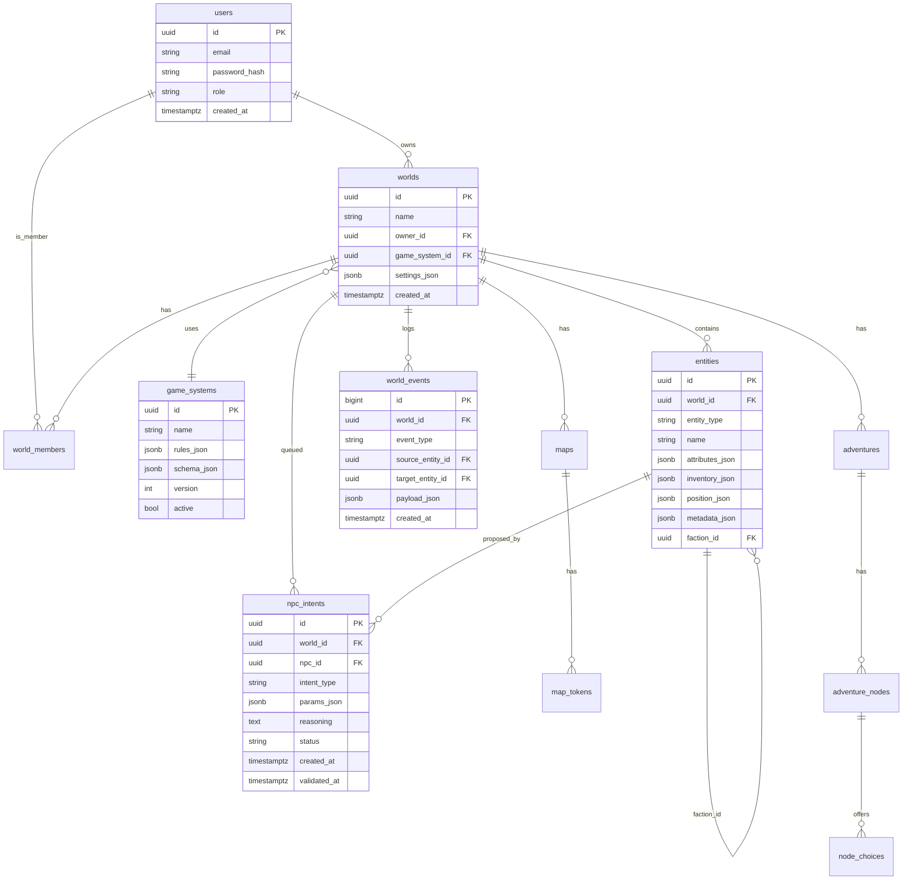

# Datenmodell

> Vollständiges Schema + Flyway-Migrationskonzept.

---

## 1. Konventionen

- Primary Keys: `UUID DEFAULT gen_random_uuid()`
- Timestamps: `TIMESTAMPTZ DEFAULT NOW()`
- Audit-Spalten: `created_at`, `updated_at` für jede Tabelle
- Foreign Keys: `ON DELETE` entweder `CASCADE` (Child ohne Parent sinnlos) oder `RESTRICT` (Parent zuerst updaten)
- JSONB-Spalten:Spacer `*_json`-Suffix
- Indizes: auf `tenant_id`-Spalten und häufigen Filterkombinationen

---

## 2. ER-Diagramm (Auszug der Kern-Tabellen)



---

## 3. Voller Schema-Katalog

### 3.1 `users`
| Spalte | Typ | Constraints | Beschreibung |
|---|---|---|---|
| id | UUID | PK | |
| email | VARCHAR(200) | UNIQUE, NOT NULL | |
| username | VARCHAR(100) | UNIQUE, NOT NULL | |
| password_hash | VARCHAR(200) | NOT NULL | BCrypt |
| role | VARCHAR(20) | NOT NULL, CHECK IN (`USER`, `ADMIN`) | Default `USER` |
| locale | VARCHAR(10) | NOT NULL, DEFAULT `de` | BCP 47-Tag (z. B. `de`, `en`, `fr`). Default aus `Accept-Language` bei Registrierung übernommen. Siehe [`ADR/007`](ADR/007-internationalization-strategy.md) |
| created_at | TIMESTAMPTZ | DEFAULT NOW() | |
| updated_at | TIMESTAMPTZ | DEFAULT NOW() | |

**Indizes:** `users_email_idx` (UNIQUE), `users_role_idx`

---

### 3.2 `game_systems`
| Spalte | Typ | Constraints | Beschreibung |
|---|---|---|---|
| id | UUID | PK | |
| name | VARCHAR(100) | NOT NULL | z. B. „D20Lite" |
| version | INTEGER | DEFAULT 1 | Schema-Versionsnummer |
| rules_json | JSONB | NOT NULL | Siehe [`RULES-SCHEMA.md`](RULES-SCHEMA.md) |
| schema_json | JSONB | NOT NULL | JSON-Schema zur Validierung von `rules_json` |
| active | BOOLEAN | DEFAULT true | Soft-delete |
| created_at | TIMESTAMPTZ | DEFAULT NOW() | |
| updated_at | TIMESTAMPTZ | DEFAULT NOW() | |

**Indizes:** `game_systems_name_idx`

---

### 3.3 `worlds`
| Spalte | Typ | Constraints | Beschreibung |
|---|---|---|---|
| id | UUID | PK | |
| name | VARCHAR(200) | NOT NULL | |
| owner_id | UUID | NOT NULL, FK users(id) ON DELETE RESTRICT | Multi-Tenancy-Schlüssel |
| game_system_id | UUID | FK game_systems(id) ON DELETE SET NULL | |
| settings_json | JSONB | DEFAULT `{}` | Siehe [Settings-Schema](#settings-schema) — inkl. `time`-Block laut [`ADR/009`](ADR/009-world-time-calendar-system.md) |
| current_game_time | TIMESTAMPTZ | NULL | In-Game-Zeit der Welt. NULL bis Weltzeit initial via Tick oder `POST /time/set` gesetzt. Dedizierte Spalte wegen häufiger Updates und Index-Relevanz für NPC-Zeitlogik. Siehe [`ADR/009`](ADR/009-world-time-calendar-system.md) |
| last_tick_at | TIMESTAMPTZ | NULL | Echtzeitstempel des letzten automatischen Ticks. NULL bis erster Tick durch `WorldTimeService`. Siehe [`ADR/009`](ADR/009-world-time-calendar-system.md) |
| created_at | TIMESTAMPTZ | DEFAULT NOW() | |
| updated_at | TIMESTAMPTZ | DEFAULT NOW() | |

**Indizes:** `worlds_owner_id_idx`, `worlds_game_system_id_idx`

#### <a name="settings-schema"></a> `settings_json` Schema
```json
{
  "ai_mode": "autonom" | "suggest" | "off",
  "visibility": "fog_of_war" | "full",
  "grid": "square" | "hex",
  "language": "de | en | fr | es | pl | it | ...",   // BCP 47-Tag; Default-Locale der NPC-Sprache und UI
  "time": {
    "mode": "automatic" | "manual" | "hybrid",
    "tick_interval_real_seconds": 60,
    "tick_advance_game_minutes": 60,
    "calendar_system": "gregorian",
    "start_time": "2025-03-15T06:00:00",
    "paused": false,
    "day_starts_at_hour": 6
  }
}
```

`language` ist ein BCP 47-Tag (z. B. `de`, `en`, `pt-BR`). Für LLM-Prompts und Default-UI-Sprache in dieser Welt. Siehe [`ADR/007`](ADR/007-internationalization-strategy.md).

`time` steuert die In-Game-Zeit der Welt — siehe [`ADR/009`](ADR/009-world-time-calendar-system.md) für Modi und Feldbedeutungen. Persistente In-Game-Zeit liegt in `worlds.current_game_time` (dedizierte Spalte, nicht in `settings_json`).

---

### 3.4 `world_members`
| Spalte | Typ | Constraints | Beschreibung |
|---|---|---|---|
| id | UUID | PK | |
| world_id | UUID | NOT NULL, FK worlds(id) ON DELETE CASCADE | |
| user_id | UUID | NOT NULL, FK users(id) ON DELETE CASCADE | |
| role | VARCHAR(20) | NOT NULL, CHECK IN (`PLAYER`, `DM`) | |
| joined_at | TIMESTAMPTZ | DEFAULT NOW() | |

**Uniques:** `(world_id, user_id)`

---

### 3.5 `entities`
| Spalte | Typ | Constraints | Beschreibung |
|---|---|---|---|
| id | UUID | PK | |
| world_id | UUID | NOT NULL, FK worlds(id) ON DELETE CASCADE | |
| entity_type | VARCHAR(20) | NOT NULL, CHECK IN (`PC`, `NPC`, `FACTION`) | Discriminator |
| name | VARCHAR(200) | NOT NULL | |
| attributes_json | JSONB | DEFAULT `{}` | Dynamisch, laut Regelwerk |
| inventory_json | JSONB | DEFAULT `[]` | Siehe [Inventory-Format](#inventory-format) |
| position_json | JSONB | NULL | `{ map_id, x, y }` |
| metadata_json | JSONB | DEFAULT `{}` | NPC: `{ personality, knowledge, goals }` |
| skills_json | JSONB | NULL | Per-Character Skill-Overrides: `{ "Athletik": 5 }` |
| faction_id | UUID | FK entities(id) ON DELETE SET NULL | |
| experience_points | INT | DEFAULT 0 | |
| hp_current | INT | DEFAULT 10 | |
| hp_max | INT | DEFAULT 10 | |
| ap_current | INT | DEFAULT 2 | |
| ap_max | INT | DEFAULT 2 | |
| created_at | TIMESTAMPTZ | DEFAULT NOW() | |
| updated_at | TIMESTAMPTZ | DEFAULT NOW() | |

**Indizes:** `entities_world_id_idx`, `entities_faction_id_idx`, `entities_type_idx`
**GIN-Indizes:** `entities_attributes_json_idx` (GIN), `entities_metadata_json_idx` (GIN), `entities_skills_json_idx` (GIN)

#### <a name="inventory-format"></a> `inventory_json` Format
```json
[
  { "item_id": "uuid", "quantity": 2, "equipped": false },
  { "item_id": "uuid", "quantity": 1, "equipped": true, "slot": "weapon" }
]
```

---

### 3.6 `items` (Katalog)
| Spalte | Typ | Constraints | Beschreibung |
|---|---|---|---|
| id | UUID | PK | |
| world_id | UUID | FK worlds(id) ON DELETE CASCADE | Item pool ist per Welt |
| name | VARCHAR(200) | NOT NULL | |
| type | VARCHAR(50) | NOT NULL, CHECK IN (`WEAPON`, `ARMOR`, `CONSUMABLE`, `MISC`) | |
| weight | NUMERIC(10, 2) | DEFAULT 0 | |
| value | INTEGER | DEFAULT 0 | In Spielwährung |
| bonuses_json | JSONB | DEFAULT `{}` | `{ strength: 2, initiative: 1 }` |
| metadata_json | JSONB | DEFAULT `{}` | Beliebig |
| created_at | TIMESTAMPTZ | DEFAULT NOW() | |
| updated_at | TIMESTAMPTZ | DEFAULT NOW() | |

**Indizes:** `items_world_id_idx`

---

### 3.7 `maps`
| Spalte | Typ | Constraints | Beschreibung |
|---|---|---|---|
| id | UUID | PK | |
| world_id | UUID | NOT NULL, FK worlds(id) ON DELETE CASCADE | |
| name | VARCHAR(200) | NOT NULL | |
| width | INTEGER | NOT NULL | Tiles |
| height | INTEGER | NOT NULL | Tiles |
| grid | VARCHAR(20) | NOT NULL, CHECK IN (`SQUARE`, `HEX`) | |
| background_url | VARCHAR(500) | NULL | URL/Path zu Bild |
| fog_state_json | JSONB | DEFAULT `{}` | Persisted masks |
| created_at | TIMESTAMPTZ | DEFAULT NOW() | |
| updated_at | TIMESTAMPTZ | DEFAULT NOW() | |

**Indizes:** `maps_world_id_idx`

---

### 3.8 `map_tokens`
| Spalte | Typ | Constraints | Beschreibung |
|---|---|---|---|
| id | UUID | PK | |
| map_id | UUID | NOT NULL, FK maps(id) ON DELETE CASCADE | |
| entity_id | UUID | FK entities(id) ON DELETE CASCADE |NULLable für non-entity Tokens |
| x | INTEGER | NOT NULL | Tile |
| y | INTEGER | NOT NULL | Tile |
| visible_to | UUID | FK entities(id) | NULL = visible to all (Spieler) |
| created_at | TIMESTAMPTZ | DEFAULT NOW() | |
| updated_at | TIMESTAMPTZ | DEFAULT NOW() | |

**Indizes:** `map_tokens_map_id_idx`, `map_tokens_entity_id_idx`

---

### 3.9 `adventures`
| Spalte | Typ | Constraints | Beschreibung |
|---|---|---|---|
| id | UUID | PK | |
| world_id | UUID | NOT NULL, FK worlds(id) ON DELETE CASCADE | |
| name | VARCHAR(200) | NOT NULL | |
| description | TEXT | NULL | |
| start_node_id | UUID | FK adventure_nodes(id) | |
| created_at | TIMESTAMPTZ | DEFAULT NOW() | |
| updated_at | TIMESTAMPTZ | DEFAULT NOW() | |

---

### 3.10 `adventure_nodes`
| Spalte | Typ | Constraints | Beschreibung |
|---|---|---|---|
| id | UUID | PK | |
| adventure_id | UUID | NOT NULL, FK adventures(id) ON DELETE CASCADE | |
| text | TEXT | NOT NULL | |
| image_url | VARCHAR(500) | NULL | |
| is_end | BOOLEAN | DEFAULT false | |
| created_at | TIMESTAMPTZ | DEFAULT NOW() | |
| updated_at | TIMESTAMPTZ | DEFAULT NOW() | |

---

### 3.11 `node_choices`
| Spalte | Typ | Constraints | Beschreibung |
|---|---|---|---|
| id | UUID | PK | |
| node_id | UUID | NOT NULL, FK adventure_nodes(id) ON DELETE CASCADE | |
| label | VARCHAR(200) | NOT NULL | Button-Text |
| target_node_id | UUID | FK adventure_nodes(id) | Direkt-Fall |
| skill_check | JSONB | NULL | `{ skill: "stärke", modifier: 5 }` |
| on_success_node_id | UUID | FK adventure_nodes(id) | Skill-Erfolg |
| on_failure_node_id | UUID | FK adventure_nodes(id) | Skill-Misserfolg |
| created_at | TIMESTAMPTZ | DEFAULT NOW() | |

---

### 3.12 `adventure_progress` (pro Character)
| Spalte | Typ | Constraints | Beschreibung |
|---|---|---|---|
| id | UUID | PK | |
| adventure_id | UUID | NOT NULL, FK adventures(id) ON DELETE CASCADE | |
| entity_id | UUID | NOT NULL, FK entities(id) ON DELETE CASCADE | |
| current_node_id | UUID | NOT NULL, FK adventure_nodes(id) | |
| visited_nodes | UUID[] | DEFAULT `{}` | Array von node_ids |
| status | VARCHAR(20) | CHECK IN (`ACTIVE`, `COMPLETED`, `ABANDONED`) | |
| started_at | TIMESTAMPTZ | DEFAULT NOW() | |
| updated_at | TIMESTAMPTZ | DEFAULT NOW() | |

**Unique:** `(adventure_id, entity_id)`

---

### 3.13 `world_events`
| Spalte | Typ | Constraints | Beschreibung |
|---|---|---|---|
| id | BIGSERIAL | PK | Sequentiall für Performance |
| world_id | UUID | NOT NULL, FK worlds(id) ON DELETE CASCADE | |
| event_type | VARCHAR(50) | NOT NULL | Siehe [Event-Typen](#event-typen) |
| source_entity_id | UUID | FK entities(id) ON DELETE SET NULL | |
| target_entity_id | UUID | FK entities(id) ON DELETE SET NULL | |
| payload_json | JSONB | DEFAULT `{}` | Event-spezifische Daten |
| event_hash | VARCHAR(64) | NULL | Idempotenz-Hash (optional) |
| created_at | TIMESTampsTZ | DEFAULT NOW() | |

**Indizes:** `idx_events_world_time (world_id, created_at DESC)`, `idx_events_type (world_id, event_type)`

#### <a name="event-typen"></a> Event-Typen (Enum)
```
PROBE_ROLLED, COMBAT_STARTED, COMBAT_ENDED, ENTITY_MOVED,
ITEM_PICKED_UP, ITEM_EQUIPPED, FIRE_CREATED, FIRE_EXTINGUISHED,
NPC_INTENT_PROPOSED, NPC_INTENT_APPROVED, NPC_INTENT_REJECTED,
WORLD_CREATED, SESSION_STARTED, SESSION_ENDED
```

---

### 3.14 `npc_intents`
| Spalte | Typ | Constraints | Beschreibung |
|---|---|---|---|
| id | UUID | PK | |
| world_id | UUID | NOT NULL, FK worlds(id) ON DELETE CASCADE | |
| npc_id | UUID | NOT NULL, FK entities(id) ON DELETE CASCADE | |
| intent_type | VARCHAR(50) | NOT NULL, CHECK IN (`ATTACK`, `MOVE`, `SPEAK`, `USE_ITEM`, `IDLE`) | |
| params_json | JSONB | NOT NULL | `{ target_id, weapon_id, destination, speech_text }` |
| reasoning | TEXT | NULL | Begründung aus LLM |
| status | VARCHAR(20) | DEFAULT `pending`, CHECK IN (`pending`, `approved`, `rejected`, `executed`, `failed`) | |
| rejection_reason | TEXT | NULL | Bei `rejected` oder `failed` |
| created_at | TIMESTAMPTZ | DEFAULT NOW() | |
| validated_at | TIMESTAMPTZ | NULL | Approval/Rejection-Zeitstempel |

**Indizes:** `npc_intents_world_status_idx (world_id, status)`, `npc_intents_created_at_idx`

---

### 3.15 `combat_sessions`
| Spalte | Typ | Constraints | Beschreibung |
|---|---|---|---|
| id | UUID | PK | |
| world_id | UUID | NOT NULL, FK worlds(id) ON DELETE CASCADE | |
| current_turn_entity_id | UUID | FK entities(id) | |
| round | INTEGER | DEFAULT 1 | |
| status | VARCHAR(20) | CHECK IN (`ACTIVE`, `ENDED`) | |
| created_at | TIMESTAMPTZ | DEFAULT NOW() | |
| ended_at | TIMESTAMPTZ | NULL | |

---

### 3.16 `combat_participants`
| Spalte | Typ | Constraints | Beschreibung |
|---|---|---|---|
| id | UUID | PK | |
| combat_id | UUID | NOT NULL, FK combat_sessions(id) ON DELETE CASCADE | |
| entity_id | UUID | NOT NULL, FK entities(id) ON DELETE CASCADE | |
| initiative | INTEGER | NOT NULL | Höher = früher am Zug |
| ap_current | INTEGER | NOT NULL | Action Points |
| ap_max | INTEGER | NOT NULL | |
| side | VARCHAR(20) | CHECK IN (`A`, `B`, `NEUTRAL`) | |

---

## 4. Flyway-Migrationskonzept

```
src/main/resources/db/migration/
├── V001__initial.sql            # users, game_systems, worlds, world_members, entities, world_events, npc_intents
├── V002__auth.sql               # refresh_tokens (JWT-Refresh)
├── V003__world_softdelete.sql   # worlds.active + entities.active (Soft-Delete)
├── V004__combat.sql             # combat_sessions, combat_participants
├── V005__items.sql              # items-Katalog (Waffen, Rüstungen, etc.)
└── V006__adventures.sql         # adventures, adventure_nodes, node_choices, adventure_progress
```

Konventions:
- Versionsnummern pro Phase: Phase 1 = V001–V002, Phase 2 = V003–V006, Phase 5 = V010–V011
- Keine `ALTER TABLE` auf bereits in Produktion gerollte Migrationsdateien — neue Migration für Schema-Anpassungen
- Idempotente DDL, wo möglich (`IF NOT EXISTS`)
- `users.locale` ist Teil von `V001__initial.sql` (von Anfang an) — siehe [`ADR/007`](ADR/007-internationalization-strategy.md)

---

## 5. JSONB-Strategie

| Zweck | Warum JSONB |
|---|---|
| `game_systems.rules_json` | Regelwerke variieren stark zwischen Systemen (D20 vs. Pool). Relational wäre zu starr. |
| `entities.attributes_json` | Verschiedene Systeme haben unterschiedliche Attribute (Stärke vs. Körperfertigkeit). |
| `entities.metadata_json` (NPC) | Persönlichkeit, knowledge extensible — wächst mit LLM-Sophistication. |
| `npc_intents.params_json` | Parameter variieren per Intent-Typ (target_id vs. destination vs. speech_text). |

**Indizierung von JSONB:**
- GIN-Indizes für `attributes_json` und `metadata_json` (für `@>`-Operator)
- Functional-Indizes für häufige Pfade, z. B. `((metadata_json->>'personality'))`

**Anti-Pattern:** Keine Suchspalten aus JSONB extrahieren, die häufig in WHERE-Klauseln stehen — dann besser dedizierte Spalte.