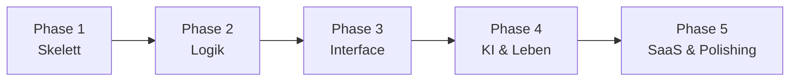

# Roadmap

> Übersichts-Roadmap. Granular abarbeitbare Tasks siehe [`TASKS.md`](TASKS.md).

---

## Übersicht

| Phase | Name | Zeitaufwand (Richtwert) | Meilenstein |
|---|---|---|---|
| 1 | Das Skelett | Woche 1–4 | **M1**: Welt erstellt |
| 2 | Die Logik | Woche 5–8 | **M2**: Charakter würfelt regelkonform |
| 3 | Das Interface | Woche 9–14 | **M3**: Spieler interagiert live auf Karte |
| 4 | KI & Lebendigkeit | Woche 15–20 | **M4**: NPC handelt autonom |
| 5 | SaaS & Polishing | Woche 21+ | **M5**: Dritter kann sich registrieren + Welt spielen |

---

## Phase 1 — Das Skelett (Woche 1–4)

| Attribut | Wert |
|---|---|
| **Ziel** | Backend-Struktur, Datenbank, Basis-API stehen |
| **Meilenstein** | **M1**: „Welt erstellt" |
| **Erfolgskriterium** | `curl` kann Welt mit Regelwerk anlegen, Charakter erstellen und ein WS-Event empfangen |
| **Tasks** | P1-T01 … P1-T09 (siehe TASKS.md) |
| **Phasenabgrenzung** | Keine Rule-Engine-Logik, keine UI, kein AI-Bot |

**Inhalt**
- Spring Boot 3.3.x + Java 21 Projektgerüst
- PostgreSQL (externer Portainer-Server 192.168.31.151:5432) + Flyway-Migration
- Authentifizierung (JWT)
- Game-System Repository + JSON-Schema-Validator
- World + Entity Repository + REST-Endpoints
- WebSocket-Konfiguration (STOMP) mit Test-Topic
- Backend-i18n-Grundgerüst (MessageSource, DE + EN)
- Podman Compose (pgAdmin, Backend läuft lokal via Maven)

---

## Phase 2 — Die Logik (Woche 5–8)

| Attribut | Wert |
|---|---|
| **Ziel** | Spielmechanik funktioniert |
| **Meilenstein** | **M2**: „Charakter würfelt regelkonform" |
| **Erfolgskriterium** | Ein Charakter führt über die API eine Probe basierend auf JSON-Regelwerk aus; Ergebnis wird validiert, geloggt und über WS verbreitet |
| **Tasks** | P2-T01 … P2-T08 |
| **Phasenabgrenzung** | Noch kein Frontend; alle Endpunkte via `curl` / Postman |

**Inhalt**
- Rule-Engine (Interface + Implementierung)
- Probe-Service + REST `/api/v1/rolls`
- Kampf-System (Initiative, Turns, Aktionen) — Turn-basiert
- Inventar-System + Equip-Berechnung
- Abenteuer-Struktur (Node-basiert, JSON)
- Event-Log-Architektur (`world_events`)
- Time Engine (`WorldTimeService`): automatic/manual/hybrid, DM kann Tag überspringen — siehe [`ADR/009`](ADR/009-world-time-calendar-system.md)
- Integrationstests für Regel-Engine

---

## Phase 3 — Das Interface (Woche 9–14)

| Attribut | Wert |
|---|---|
| **Ziel** | Frontend steht; Spieler können interagieren |
| **Meilenstein** | **M3**: „Spieler interagiert live auf Karte" |
| **Erfolgskriterium** | Spieler können sich einloggen, eine Welt betreten, Token bewegen, Würfel werfen, Chat/Log nutzen |
| **Tasks** | P3-T01 … P3-T12 |
| **Phasenabgrenzung** | Noch kein AI-Bot; NPCs sind statisch bzw. vom DM gesteuert |

**Inhalt**
- Vite + React + TypeScript + pnpm Setup
- Zustand-Store + STOMP-Client Setup inkl. i18next (DE + EN)
- Auth-UI (Login/Register) — vollständig lokalisiert
- Dashboard + Welt-Management
- Charakterbogen (dynamisch aus Regelwerk)
- Inventar-UI
- PixiJS-Canvas-Grundgerüst + Grid + Token-Drag
- Fog of War (Canvas-Compositing)
- Chat + Wurf-Logs
- Frontend-i18n-Durchgang (alle Strings via `t()`, Sprachumschalter)

---

## Phase 4 — KI & Lebendigkeit (Woche 15–20)

| Attribut | Wert |
|---|---|
| **Ziel** | Der „Living World"-Teil funktioniert |
| **Meilenstein** | **M4**: „NPC handelt autonom" |
| **Erfolgskriterium** | Ein NPC greift automatisch an, weil ein Spieler ein Lagerfeuer entzündet hat — ohne DM-Eingriff. DM kann im Log sehen und überstimmen. |
| **Tasks** | P4-T01 … P4-T07 |
| **Phasenabgrenzung** | Noch keine Multi-Tenancy-Komplexität; ein Tenant reicht |

**Inhalt**
- Python/FastAPI Bot-Service Setup (eigenes OCI-Image via Podman)
- Event-Polling (Bot → Server)
- NPC-Kontext-Loader (Daten sammeln, Prompt bauen)
- Prompt-Templates pro NPC-Typ (sprachenbewusst via `worlds.settings_json.language`)
- Ollama-Integration (lokal, Llama 3)
- NPC-Intent REST-Endpoint + Validator-Schicht
- Human-Fallback im DM-Interface (pending intents)

---

## Phase 5 — SaaS & Polishing (Woche 21+)

| Attribut | Wert |
|---|---|
| **Ziel** | Veröffentlichung und Skalierung |
| **Meilenstein** | **M5**: „Dritter kann Welt spielen" |
| **Erfolgskriterium** | Dritter registriert sich, erstellt Welt, lädt Freunde ein, spielt eine Session |
| **Tasks** | P5-T01 … P5-T07 |
| **Phasenabgrenzung** | — |

**Inhalt**
- Multi-Tenancy Isolation (Row-Level Security)
- Redis-Cache für Regelwerke und Welt-Status
- Event-Archivierung (älter 30 Tage → Archive-Tabelle)
- Admin-Dashboard Backend + Frontend
- Production Containerfile + Nginx-Setup (via Podman)
- CI/CD (GitHub Actions, podman-basiert)

---

## Abhängigkeiten zwischen Phasen

Phase 4 und in Teilen Phase 5 könnten parallelisiert werden, wenn genug Kapazität vorhanden ist. Empfehlung jedoch: **sequentiell arbeiten**, um eine stabile Basis zu erhalten.