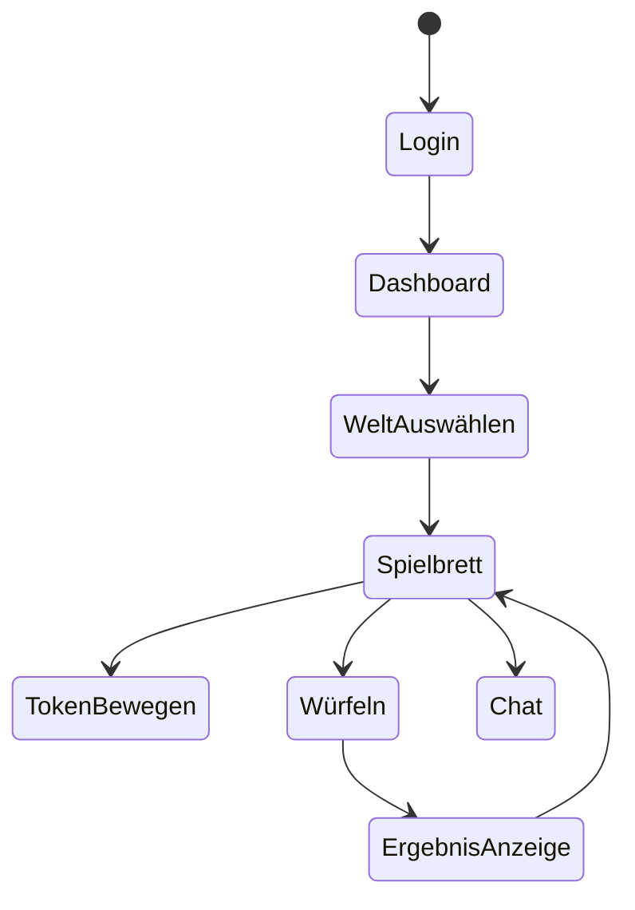
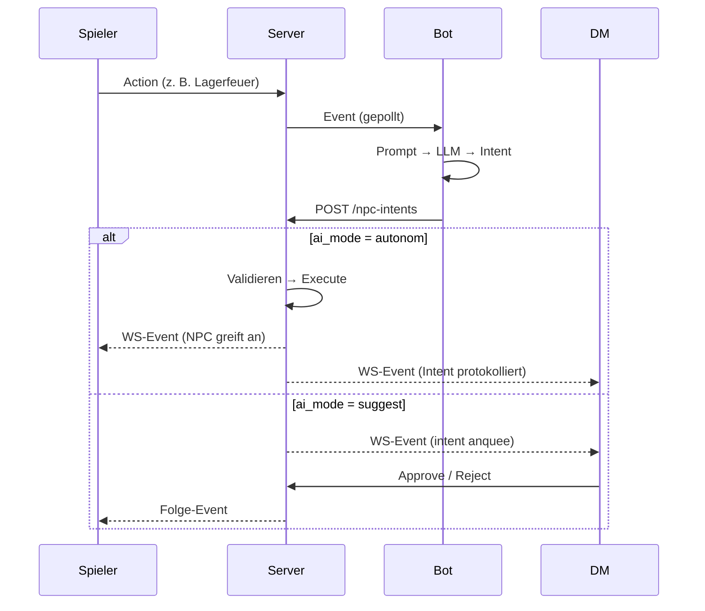

# UI/UX

> Design-Prinzipien, Komponenten-Struktur, Benutzerflows, Tastatur+Accessibility-Regeln.

---

## 1. Design-Prinzipien

| Prinzip | Bedeutung |
|---|---|
| **Table-first** | Die Karte dominiert den Bildschirm. Charakterbogen ist Sekundäransicht. |
| **Scheinbar intelligent** | Spieler spüren, dass die Welt „lebt" — NPC-Aktionen erscheinen ohne DM-Eingriff. |
| **Dark Mode-first** | Augenfreundlich bei langen Sitzungen. Light-Mode via Settings. |
| **Gaming-affin, niet chrome** | Keine „Rollenspiel-Skin"-Texturen. Modern, flach, klare Hierarchie. |
| **DM als Dirigent, nicht Croupier** | DM-Tools sind mächtig, aber nicht im Weg, wenn er nur begleiten will. |
| **Keyboard-first** | Würfeln, navigieren, chatten — alles ohne Maus möglich. |
| **Multi-Lingual by default** | UI in User-Locale; NPC-Sprache folgt Welt-Setting. DE + EN ab Launch. Siehe [`ADR/007`](ADR/007-internationalization-strategy.md) |

---

## 2. Layout-Konzept

### 2.1 Main Layout (Welt aktive)

```
┌───────────────────────────────────────────────────────────────────┐
│  Top Bar  │ LWE Logo │ Weltname+Status 🌐(Lang) │ User-Menü       │
├────────────┼──────────────────────────────────┬────────────────────┤
│  Sidebar   │                                  │   Right Panel       │
│            │                                  │                     │
│  Charakter │       Map Canvas                 │   ┌────────────┐    │
│  -Bogen    │       (PixiJS)                  │   │ Chat       │    │
│            │                                  │   │            │    │
│  Inventar  │                                  │   │            │    │
│            │                                  │   │            │    │
│  NPC-Liste │                                  │   ├────────────┤    │
│  (DM only) │                                  │   │ Wurf-Log   │    │
│            │                                  │   │            │    │
│  DM Queue  │                                  │   │            │    │
│  (DM only) │                                  │   └────────────┘    │
│            │                                  │                     │
├────────────┴──────────────────────────────────┴────────────────────┤
│  Status Bar │ FPS: 60 │ Latenz: 42ms │ KI: suggest │ ⏱ 14:30 Tag │ Turn: 3 │
└───────────────────────────────────────────────────────────────────┘
```

Das ⏱-Symbol zeigt die In-Game-Weltzeit (lokalisiert via `Intl.DateTimeFormat` mit User-Locale) + Tag-Phase an. Rechts davon in der Status Bar (DM-only): ⏸/▶ Pause/Resume, ⏩ Advance-Buttons.

Das 🌐-Symbol in der TopBar öffnet den Sprachumschalter (Dropdown: Deutsch / English / ...). Persistiert in `users.locale` via `POST /api/users/me/preferences`.

### 2.2 Panel-Aufteilung

| Spalte | Standardbreite | Inhalte | Zielgruppe |
|---|---|---|---|
| **Sidebar** | 280 px (collapsible) | Charakterbogen → Inventar → NPC-Liste → DM-Tools | Spieler + DM |
| **Center** | flexibel (Rest) | PixiJS-Canvas | Alle |
| **Right** | 320 px (collapsible) | Chat → Wurf-Log → Aktion-Schnelltasten | Alle |
| **Top Bar** | 56 px | Logo + Weltname + Session-Status + User-Menü | Alle |
| **Status Bar** | 24 px | FPS / Latenz / KI-Modus / aktueller Turn | Alle |

---

## 3. Komponenten-Struktur (React)

```
<App>
  <Router>
    <PublicRoutes>
      <LoginPage />
      <RegisterPage />
    </PublicRoutes>
    <ProtectedRoutes>
      <AuthGuard>
        <DashboardLayout>
          <DashboardPage />      # Meine Welten
          <WorldEditorPage />
        </DashboardLayout>
        <WorldLayout>            # Sobald Welt betreten
          <TopBar />
          <Sidebar />
            <CharacterSheetPanel />
            <InventoryPanel />
            <NpcListPanel />     (DM only)
            <DmQueuePanel />      (DM only)
          <MapCanvas />          # PixiJS
            <FogOfWarLayer />
            <TokenLayer />
            <GridLayer />
          <RightPanel />
            <ChatPanel />
            <RollLog />
          <StatusBar />
        </WorldLayout>
        <AdminLayout>           (Phase 5)
          <AdminUserList />
          <AdminBotStatus />
        </AdminLayout>
      </AuthGuard>
    </ProtectedRoutes>
  </Router>
</App>
```

### Ordnerstruktur
```
frontend/src/
├── api/                  # http clients, types
├── components/
│   ├── auth/
│   ├── character/
│   ├── inventory/
│   ├── map/
│   ├── chat/
│   ├── dm/
│   └── ui/                # Generic primitives (Button, Modal, ...)
├── hooks/
├── pages/
├── store/
│   ├── authStore.ts
│   ├── worldStore.ts
│   ├── mapStore.ts
│   ├── chatStore.ts
│   └── intentStore.ts
├── types/
└── App.tsx
```

---

## 4. Benutzerflows

### 4.1 Spieler-Flow


### 4.2 DM-Flow
```mermaid
stateDiagram-v2
    [*] --> Login
    Login --> Dashboard
    Dashboard --> WeltErstellen
    WeltErstellen --> RegelwerkAuswählen
    Dashboard --> WeltBearbeiten
    Dashboard --> SessionStarten
    SessionStarten --> SpielerEinladen
    SpielerEinladen --> Spielbrett
    Spielbrett --> KI-ModusUmschalten
    Spielbrett --> IntentApproveReject
```

### 4.3 AI-NPC-Flow


---

## 5. Charakterbogen (Dynamic)

### 5.1 Rendering-Strategie

Charakterbogen wird aus `game_system.attributes_json` + `game_system.skills_json` generiert. Drei Arten von Widgets:

| Widget-Typ | Triggers-Bedingung |
|---|---|
| `INT` | Range-Input mit +/− Buttons |
| `STRING` | Text-Input (z. B. Hintergrund) |
| `BOOL` | Switch (z. B. „Hat Magie") |

Skills werden als liste mit „Würfeln"-Button angezeigt.

### 5.2 Würfel-Interaktion
1. Spieler klickt auf Würfel-Icon neben Skill
2. Modal öffnet sich: `Modifier`-Feld (default 0), `Target`-Feld (optional)
3. Roll triggert `POST /api/rolls`
4. Würfelanimation (≈1,5 s, nicht zu lange)
5. Ergebnis erscheint im Chat und im Wurf-Log
6. Invalidate von betroffenem Welt-Status (z. B. HP bei Schadensprobe)

### 5.3 Inventory-Bereich
- Drag-and-drop mit `@dnd-kit/core` (reaktionsfreudig, keyboard-zugänglich)
- Drag aus Inventar in Equip-Slot
- Stack-Items als Badge mit quantity
- Hover-Tooltip zeigt Item-Boni

---

## 6. Karten-Canvas (PixiJS)

### 6.1 PixiJS-Application
- Single `<MapCanvas>` Host, darin intern eine `PIXI.Application`
- DPR-bewusst (Retina)
- 60 fps target
- Throttle für WS-speaking Token-Bewegungen auf 30 Hz

### 6.2 Layer (bottom-to-top)
1. **BackgroundLayer** — Tilemap / Bild
2. **GridLayer** — Quadratisch oder Hex
3. **FogOfWarLayer** — DM-controlled
4. **TokenLayer** — Charakter- und NPC-Tokens
5. **SelectionLayer** — Markierungen
6. **PathLayer** — DM-only: Pfad bei Move-Intent

### 6.3 Token-Dragging
- Pause WS-Broadcast bei Drag-In progress (verhindert Jitter)
- Beim Drop: final Position per `mapUpdate` WS-Nachricht an Backend
- Andere Clients sehen smooth Interpolation

### 6.4 Fog of War
- Separate PixiJS-Grafik, `blendMode = MULTIPLY` (overlay)
- DM-Tools: Polygon-Rechteck oder Freihand-Mask
- `fog_state_json` in `maps` persistiert
- Spieler sehen nur Maske, DM sieht ale Magnet tools + aktuelle Maske

### 6.5 Zoom & Pan
- Mausrad: Zoom (0.25x – 4x), Fokuspunkt folgt Cursor
- Drag in leeren Bereich: Panned (Hand-Symbol)
- `Cmd+Scroll` oder Mit Trade-Ctrl: Fein-Zoom

---

## 7. DM-Tools

### 7.1 DM-only UI-Regionen
- NPC-Liste (z. B. „Wer lebt noch?") im Sidebar
- DM-Queue Panel (zur Approval pending Intents)
- Fog-of-War-Toolbar
- NPC direkt steuerbar (Self-Steer)

### 7.2 Inline-Aktion (Self-Steer)
- DM klickt NPC → „Steuerung übernehmen"
- NPCs AI-Bot wird für diesen NPC pausiert (via `entities.metadata_json.managed_by = "DM"`)
- DM kann für NPC sprechen, sich bewegen, handeln

### 7.3 Time-Steuerung (Weltzeit)

_DM-only-Buttons in der Status Bar / DM-Toolbar_, siehe [`ADR/009`](ADR/009-world-time-calendar-system.md). Spieler sehen die Weltzeit, dürfen sie nicht steuern.

| Button | Aktion |
|---|---|
| ⏸ Pause | `POST /api/v1/worlds/{id}/time/pause` — friert automatische Ticks ein |
| ▶ Resume | `POST /api/v1/worlds/{id}/time/resume` — setzt Ticks fort |
| ⏩ Advance | Dropdown: +1 Stunde / +6 Stunden / +1 Tag / bis Morgens / bis Abends. Triggert `POST /api/v1/worlds/{id}/time/advance` |
| 📅 Set | Modal mit DateTime-Picker. `POST /api/v1/worlds/{id}/time/set` |
| 🕓 Mode | (nur Owner) Wechselt `automatic` / `manual` / `hybrid` via `PATCH /api/v1/worlds/{id}/time/mode` |

**„Ein Tag ist vorbei"-Workflow:**
1. DM klickt ⏩ Advance → wählt „+1 Tag" (oder sprachlich „bis Morgens")
2. Frontend sendet `{ "by": "1 day" }` (oder `{ "by": "dawn" }`)
3. Backend advances In-Game-Zeit, publish `TIME_ADVANCED`, NPCs via Bot entsprechend reagieren

**Weltzeit-Anzeige in Status Bar** (alle User sichtbar):
```text
⏱ 14:30 Tag  →  lokalisiert via Intl.DateTimeFormat(userLocale)
                Tag-Phase: dawn | day | dusk | night
                Tooltip: „In-Game-Zeit dieser Welt"
```

**DM-only-Toolbar-Cluster** (rechts in Status Bar):
```
[ ⏸ ] [ ⏩ ] [ 📅 ]  (nur DM)
```

---

## 8. Tastatur-Shortcuts

| Kürzel | Aktion |
|---|---|
| `B` | Würfelpanel fokusieren |
| `I` | Inventar ein-/ausklappen |
| `M` | Karte fokussieren (Pfeiltaste scroll) |
| `Leertaste (halten)` | Drag-Lock (für Token ohne Maustaste gehalten) |
| `D` (DM only) | DM-Queue fokussieren |
| `F` (DM only) | Fog-of-War-Tool aktivieren |
| `+` / `−` | Zoom in / out |
| `0` | Reset Zoom |
| `Enter` (im Chat) | Nachricht senden |
| `/r 1d20+5` (im Chat) | Inline-Wurf |
| `Tab` | Focus Springer zwischen Panels |
| `Esc` | Aktuelle Selektion / Modus schließen |

### Conflicts
- Shortcuts deaktiviert, wenn ein Input-Feld fokussiert ist (außer Esc)

---

## 9. Accessibility (WCAG 2.2 AA)

### 9.1 Kontrast
- Text ≥ 4.5:1 Kontrastquote / Dark-Mode-Default
- Sufficient Farben für Zustände (success/error nicht nur rot-grün)

### 9.2 Keyboard-Navigation
- Logische Tab-Reihenfolge (TopBar → Sidebar → Map → RightPanel)
- Focus-Ring sichtbar (≥ 3 px outline)
- Eingabe-Modale verwendbar ohne Maus

### 9.3 SR-Unterstützung
- Karten-Regionen mit `aria-label` (z. B. „Karte: Höhle des Schreckens")
- Würfelergebnis als `aria-live="polite"` Ankündigung
- Inventory-Items semantics als Liste mit `<ul>`/`<li>`

### 9.4 Animationen
- `prefers-reduced-motion` reduziert Würfel-Animationen zu nichtig
- Fog-of-War-Updates sofort (keine Übergänge)

---

## 10. Theme

### 10.1 Farbpalette (Dark-Mode-Default)
| Token | Wert | Verwendung |
|---|---|---|
| `--bg-primary` | `#0F1419` | Hauptbackground |
| `--bg-surface` | `#1A2128` | Panels |
| `--bg-elevated` | `#232C36` | Modals, Hover |
| `--text-primary` | `#E8EDF2` | Text |
| `--text-secondary` | `#8B98A5` | Captions |
| `--accent` | `#5BB8C5` | Buttons, Focus |
| `--danger` | `#E0556B` | Error states |
| `--success` | `#7AC784` | Success states |
| `--warning` | `#F2A65A` | Pending attrs |

### 10.2 Typography
- Headings: Inter, Bold
- Body: Inter, Regular 14px / 20px line-height
- Code/Würfel: JetBrains Mono, 13px

### 10.3 Spacing
- 4-px-Raster (4, 8, 12, 16, 24, 32)

---

## 11. Frontend Tech Stack

| Library | Zweck |
|---|---|
| `react`, `react-dom` | UI-Framework |
| `react-router-dom` | Routing |
| `zustand` | State Management |
| `@stomp/stompjs` | WebSocket-Client |
| `axios` | HTTP-Client |
| `@pixi/react` | PixiJS React Bridge |
| `pixi.js` | Karten-Canvas |
| `@dnd-kit/core` | Drag-and-drop für Inventar |
| `react-i18next` + `i18next` | i18n — Namespaces pro Feature (`common`, `auth`, `character`, `map`, `chat`, `dm`). Siehe [`ADR/007`](ADR/007-internationalization-strategy.md) |
| `react-aria` + `react-stately` | Accessibility-primitives |
| `tailwindcss` | Styling |
| `framer-motion` | Animationen (reduce-motion berücksichtigt) |
| `lucide-react` | Icons |

---

## 12. Performance-Ziele

| Metrik | Ziel |
|---|---|
| Initial Load (LCP) | < 2,5 s |
| Time to Interactive | < 3,5 s |
| Bundle size (gzip) | < 800 KB |
| PixiJS FPS (100 Token) | ≥ 60 fps |
| WS-Latenz (Frontend → Backend → Frontend) | < 200 ms |
| Drag-Frame-Rate | ≥ 60 fps |

---

## 13. Geräte-Targets

| Gerät | Priorität | Notes |
|---|---|---|
| Desktop 1440p+ | P1 | Hauptplattform für DMs |
| Laptop 1366×768 | P1 | Hauptplattform für Spieler |
| Tablet (10") | P2 | Spieler am Tisch |
| Mobile PWA | P3 | Notfälle (Charakterbogen checken) |
| Mobile native | Out-of-scope | — |

---

## 14. Internationalisierung (i18n)

> Siehe [`ADR/007`](ADR/007-internationalization-strategy.md) für die Strategie.

### 14.1 Namespace-Struktur
```
frontend/src/i18n/locales/
├── de/
│   ├── common.json       # Buttons, Labels, generische Strings
│   ├── auth.json         # Login, Register, Passwort
│   ├── character.json    # Charakterbogen, Attribute, Skills
│   ├── map.json          # Karte, Token, Fog of War
│   ├── chat.json         # Chat, Wurf-Log, Inline-Befehle
│   ├── dm.json           # DM-Tools, Intent-Queue
│   └── errors.json       # Fehlermeldungen (Client-seitig)
└── en/
    └── ... (gleiche Dateien)
```

### 14.2 Anwendung in Komponenten
```tsx
import { useTranslation } from 'react-i18next';

function CharacterSheet() {
  const { t } = useTranslation('character');
  return <h1>{t('title')}</h1>;
}
```

### 14.3 Sprachumschalter (TopBar)
- Globe-Icon 🌐 öffnet Dropdown
- Liste der verfügbaren Sprachen (initial `Deutsch`, `English`)
- Auswahl → `POST /api/users/me/preferences { locale }` + `i18next.changeLanguage()`
- Locale persistent in `users.locale`

### 14.4 Locale-Auflösung (Priorität)
1. `users.locale` aus Backend (User-Setting)
2. `localStorage('lwe:locale')`
3. `navigator.language` (erster BCP 47-Tag des Browsers)
4. Fallback: `de`

### 14.5 Formatierung
- Datum/Uhrzeit: `Intl.DateTimeFormat(locale, { ... })`
- Zahlen: `Intl.NumberFormat(locale)`
- Listen: `Intl.ListFormat(locale, { type: 'conjunction' })` für „A, B und C"
- Pluralisierung: `i18next`'s eingebauter Plural-Resolver

### 14.6 NPC-Sprache (Welt-Setting)
- `worlds.settings_json.language` steuert NPC-Sprache im LLM-Prompt (`SPEAK`-Aktion `message`)
- UI-Sprache des Spielers bleibt davon unberührt — ein dt. Spieler kann in einer engl. Welt spielen und sieht NPC-Sprech in englisch, UI aber in dt.
- Optionally: später „Translate NPC speech"-Toggle (Client-seitig via LLM), out-of-scope für Phase 1–5

### 14.7 Neue Sprache hinzufügen
1. Ordner `frontend/src/i18n/locales/{code}/` anlegen + alle Namespace-JSONs kopieren und übersetzen
2. Backend: `backend/src/main/resources/i18n/messages_{code}.properties` + `validation_{code}.properties` anlegen
3. In `available_locales`-Array des Preferences-Endpunkts aufnehmen
4. CI prüft Konsistenz der Keys

### 14.8 Test-Gate
- Vitest prüft, dass alle Keys in DE und EN vorhanden sind
- Bei Inkonsistenz: CI fails
- Empfehlung: `i18next-extract` für automatisches Extrahieren neuer Keys aus dem Code

---

## 14. Offene Punkte

- Soundeffekte (Würfelklappern) optional via Setting
- Charakter-Porträt-Upload (Phase 5)
- Visuelles NPC-Beziehungsgraph-Tool (out of scope für Phase 1–5)