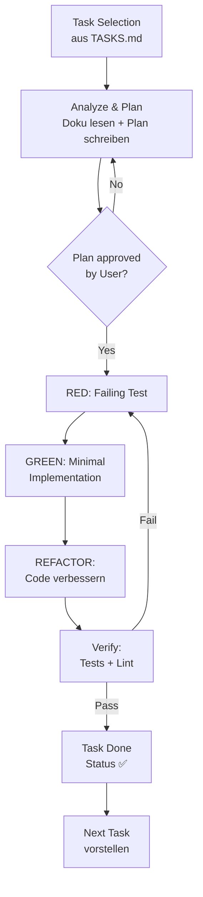

# Development Workflow

> Dieser Workflow wird für **jeden einzelnen Task** aus [`TASKS.md`](TASKS.md) befolgt. Kein Task springt direkt in die Implementierung. Jeder Task durchläuft: **Analyse → Plan-Vorlage → TDD (Red-Green-Refactor) → Verify → Done**.

---

## 1. Task Selection

Der nächste Task wird aus der Master-Liste (`TASKS.md`) anhand dieser Kriterien ausgewählt:

| Kriterium | Bedeutung |
|---|---|
| **Abhängigkeiten** | Alle gelisteten `Abhängigkeiten`-IDs müssen auf ✅ sein |
| **Phasen-Reihenfolge** | Phase 1 → 2 → 3 → 4 → 5 |
| **Priorität** | Kein Task springt vor — disziplinierte Reihenfolge |

**Ausnahme:** Ein Task darf vorzeitig starten, wenn seine Dependencies alle erfüllt sind und die Phase aktiv ist.

---

## 2. Analyze & Plan

**Bevor ein einziger Code-Zeile geschrieben wird**, analysiert der Entwickler:

- **Relevante Doku lesen:**
  - Task-Beschreibung in [`TASKS.md`](TASKS.md) (Akzeptanzkriterien + Dateien)
  - [`ARCHITECTURE.md`](ARCHITECTURE.md) — Komponenten und Datenfluss
  - [`DATA-MODEL.md`](DATA-MODEL.md) — falls neue Tabellen/Spalten nötig
  - [`API.md`](API.md) — falls neue Endpunkte nötig (ink. Error-Codes)
  - [`ADR/`](ADR/) — relevante Architektur-Entscheidungen prüfen
- **Bestehende Implementierungen analysieren** — Patterns erkennen und konsistent fortsetzen
- **Plan dokumentieren** (siehe Vorlage unten)

### Plan-Vorlage (wird dem User vorgelegt)

```markdown
## Plan: PX-TXX — [Task-Titel]

### Kurzbeschreibung
[1-2 Sätze, was dieser Task tut und warum]

### Dateien
**Neu:**
- `path/to/NewFile.java` — [Kurzbeschreibung]

**Geändert:**
- `path/to/ExistingFile.java` — [was sich ändert]

### Test-Strategie
- **Unit-Tests:** [welche Klasse testen wir isoliert?]
- **Integration-Tests:** [brauchen wir DB/Netzwerk?]
- **i18n:** [neue Keys in messages_de/en.properties?]

### Risiken / Offene Fragen
- [Gibt es Unklarheiten?]
```

### Akzeptanzkriterien
Alle Aufzählungspunkte aus `TASKS.md` unter „Akzeptanzkriterien" müssen beim Plan-Durchlauf referenziert sein. Nichts wird implementiert, das nicht in den Akzeptanzkriterien steht.

---

## 3. Plan Presentation

Der Plan aus Schritt 2 wird dem User zur Freigabe vorgelegt:

- **Strukturierte Nachricht** (Code-Blöcke, Tabellen, keine Prosa-Wände)
- **Expliziter Call-to-Action:** „Freigabe? Dann starte ich mit RED."

**Der User entscheidet, nicht der Entwickler.** Ohne explizites OK wird kein Code geschrieben.

---

## 4. TDD Implementation (Red → Green → Refactor)

Jeder Task folgt diszipliniert der TDD-Phasen:

### 🔴 4.1 RED — Failing Test schreiben

Schreibe den Test **bevor** die Produktionslogik existiert.

```java
@Test
void shouldValidateProbeRequestWhenAttributeIsUnknown() {
    Assertions.assertThrows(
        UnknownAttributeException.class,
        () -> ruleEngine.executeProbe(new ProbeRequest("unknown", 10))
    );
}
```

- **Framework:** JUnit 5 (Backend) / Vitest (Frontend) / pytest (Bot)
- **Naming:** `shouldReturnYWhenX` / `shouldThrowYWhenZ`
- **Genau ein Assert pro Test** (bzw. logisch zusammenhängende Assert-Gruppe)

### 🟢 4.2 GREEN — Minimal Implementation

Schreibe nur so viel Code, dass der Test grün wird. Nicht mehr.

```java
public ProbeResult executeProbe(ProbeRequest request) {
    if (!attributes.containsKey(request.skillId())) {
        throw new UnknownAttributeException(request.skillId());
    }
    return new ProbeResult(0, 0, false);  // minimal
}
```

- Keine Optimierungen, keine „schon mal vorausschauenden" Erweiterungen
- Erst wenn der Test grün ist → weiter mit Refactor

### 🔵 4.3 REFACTOR — Code verbessern

Jetzt darf der Code aufgeräumt werden:

- Patterns einhalten (siehe bestehende Implementierungen)
- Duplikate entfernen
- Namen verbessern
- Javadoc/Dokumentation ergänzen (wo sinnvoll)

**Wichtig:** Tests bleiben **durchgängig grün**. Kein Refactor ohne laufende Tests.

---

## 5. Verification

Nachdem Refactor abgeschlossen ist, wird **immer** die vollständige Build- und Test-Pipeline ausgeführt:

| Bereich | Befehl | Was wird geprüft |
|---|---|---|
| Backend | `cd backend && mvn verify` | Unit-Tests + Integration-Tests + Checkstyle |
| Frontend | `pnpm check` | ESLint + Prettier + TypeScript `--noEmit` |
| Frontend | `pnpm test` | Vitest (Unit + i18n-Key-Konsistenz) |
| Bot | `pytest` | Unit + Prompt-Golden-Files |

**Gates (fail on red):**
- ❌ Test-Suite nicht komplett grün → Task ist nicht fertig
- ❌ Lint-Fehler → Task ist nicht fertig
- ❌ i18n-Keys inkonsistent (`de` vs `en`) → Task ist nicht fertig

---

## 6. Task Completion

Wenn alle Gates grün sind:

1. Status in [`TASKS.md`](TASKS.md) auf **✅** setzen
2. Optional: Commit mit konventionellem Message-Format:
   ```
   feat(scope): concise summary of change
   
   Closes PX-TXX
   ```
3. Kurze Zusammenfassung an User: was wurde implementiert, was hat funktioniert, gibt es offen?

---

## 7. Next Task

Der nächste Task wird aus [`TASKS.md`](TASKS.md) identifiziert:

- Alle Dependencies geprüft
- Plan gemäß Schritt 1–3 vorgelegt

Der Entwickler zeigt dem User: **„Nächster Task: PX-TYY — [Titel]. Hier ist der Plan."**

---

## Workflow-Diagramm



---

## Verweise

- [`TASKS.md`](TASKS.md) — Task-Liste mit Akzeptanzkriterien
- [`TESTING.md`](TESTING.md) — Test-Pyramide und Frameworks
- [`API.md`](API.md) — Endpunkt-Definition inkl. Error-Codes
- [`ARCHITECTURE.md`](ARCHITECTURE.md) — Komponenten und Patterns
- [`ADR/`](ADR/) — Architektur-Entscheidungen